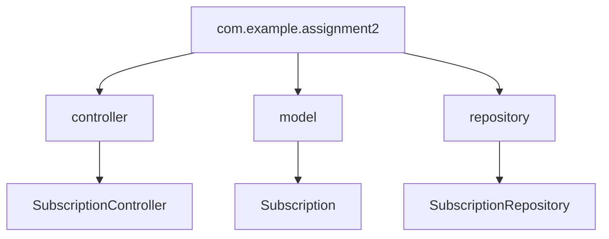
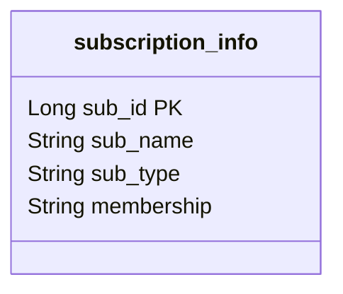

#### Assignment 2 Java API
# Subscription Management API :dependabot:
This is a build your own API assignment, where I have used some of my SQL tables from [Assignment 3](https://github.com/laila-sb/CFG-Assignment3)<link> (from previous FullStack course) to demonstrate the functionality of API endpoints. This API allows you to manage subscriptions, including creating, retrieving, and deleting subscription records. It is built using Spring Boot and follows standard coding practices for architecture, access control, and clarity.

> #### Quick Reminder
>The idea behind the database in assignment 3 was to keep track of users subscriptions. This could be a building block for a webapp to help users input their data and create a sort of tracker for all the services they might be subscribed to.


## Architecture

This project uses a RESTful architecture, leveraging Spring Boot for handling HTTP requests and managing database interactions via JPA and the `SubscriptionRepository`.

### Components:
- **Controller**: `SubscriptionController` handles incoming API requests.
- **Repository**: `SubscriptionRepository` interfaces with the database.
- **Model**: `Subscription` represents the data model for subscriptions.


### Package Structure:
Below is the Subscription table used


## Running Instructions

### Prerequisites
- Java 22
- Maven
- MySQL (DBeaver was used here, WorkBench is also fine)
- IntelliJ Idea

### Dependencies
Please see pom.xml to make sure all the required dependencies are copied over including the plugins.

### Steps to Run:
1. Clone the repository:
   ```
   git clone https://github.com/yourusername/subscription-management-api.git
   cd subscription-management-api
2. Set up the MySQL database with the following credentials (you can change them in application.yml):
3. Build and run the Main.java file
4. The API will be running at http://localhost:8080 or can be changed in the yml file
5. This can be tested using [postman.com](https://www.postman.com/)


## Editing Configuration
To change any configuration such as database credentials, edit the application.yml file or application.properties file


**Example:**
```
spring:
datasource:
url: jdbc:mysql://localhost:3306/your_db_name
username: your_username
password: your_password
server:
port: 8081  # change port if needed
```


## API Endpoints

The API documentation is available in both OpenAPI spec and Swagger UI formats:

- **OpenAPI JSON Spec**: [http://localhost:8080/v3/api-docs](http://localhost:8080/v3/api-docs)
- **Swagger UI**: [http://localhost:8080/swagger-ui.html](http://localhost:8080/swagger-ui.html)

### Example Endpoints:
- **GET** `/mysubs`: Retrieves all subscriptions.
- **POST** `/add/sub`: Creates a new subscription.
- **DELETE** `/subs/{sub_id}`: Deletes a subscription by ID.

