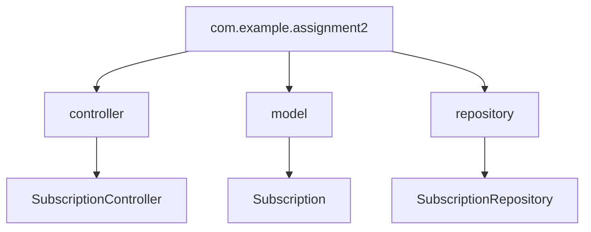
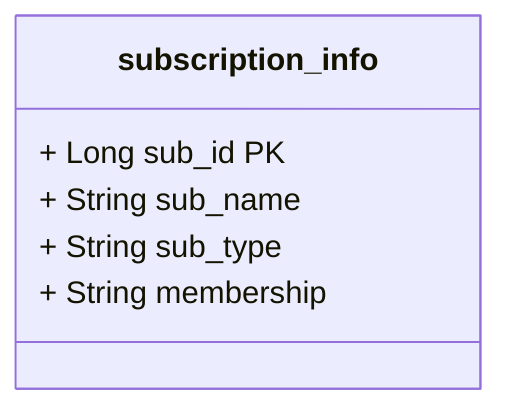

#### Assignment 2 Java API
# Subscription Management API :dependabot:
This is a build your own API assignment, where I have used some of my SQL tables from [Assignment 3](https://github.com/laila-sb/CFG-Assignment3) (from previous FullStack course) to demonstrate the functionality of API endpoints.
This API allows you to manage subscriptions, including creating, retrieving, and deleting subscription records. It uses a RESTful architecture, leveraging Spring Boot for handling HTTP requests and managing database interactions via JPA and the `SubscriptionRepository`.


> #### Quick Reminder
>The idea behind the database in assignment 3 was to keep track of users subscriptions. This could be a building block for a webapp to help users input their data and create a sort of tracker for all the services they might be subscribed to.


## Project Architecture:

This project follows a **Package by Layer** architecture, organizing the codebase by technical responsibilities rather than by features. Each layer has a specific role:

### Package by Layer:

- **Controller**: `SubscriptionController` handles incoming API requests and directing them to the appropriate service.
- **Repository**: `SubscriptionRepository` interfaces with the database.
- **Model**: `Subscription` represents the data model for subscriptions.



#### Below is the subscription_info table used


## Running Instructions

### Prerequisites
- Java 22
- Maven
- MySQL (DBeaver was used here, WorkBench is also fine)
- IntelliJ Idea

### Dependencies
Please see pom.xml to make sure all the required dependencies are copied over including the plugins.

### Steps to Run:
- Clone the repository:
   ```
   git clone https://github.com/yourusername/subscription-management-api.git
   cd subscription-management-api
- Run SQL code from the sql file using MySQL Workbench or DBeaver to create the database on your local system (change credentials in application.properties file)
- Build and run the Main.java file
- The API will be running at http://localhost:8080
- API can be tested using [Postman](https://www.postman.com/) or [Insomnia](https://insomnia.rest/)


## Editing Configuration
To change any configuration such as database credentials, edit the application.properties file


#### **Example:**
```
spring:
datasource:
url: jdbc:mysql://localhost:3306/your_db_name
username: your_username
password: your_password
server:
port: 8081  # change port if needed
```


## Testing API Endpoints with OpenAPI

The API is available in both OpenAPI spec and Swagger UI formats, once the application is running use one of the links below:

- [**OpenAPI JSON Spec**](http://localhost:8080/v3/api-docs)
- [**Swagger UI**](http://localhost:8080/swagger-ui.html)

### Example Endpoints:
- **GET** `/mysubs`: Retrieves all subscriptions.
- **POST** `/add/sub`: Creates a new subscription.
- **DELETE** `/subs/{sub_id}`: Deletes a subscription by ID.

