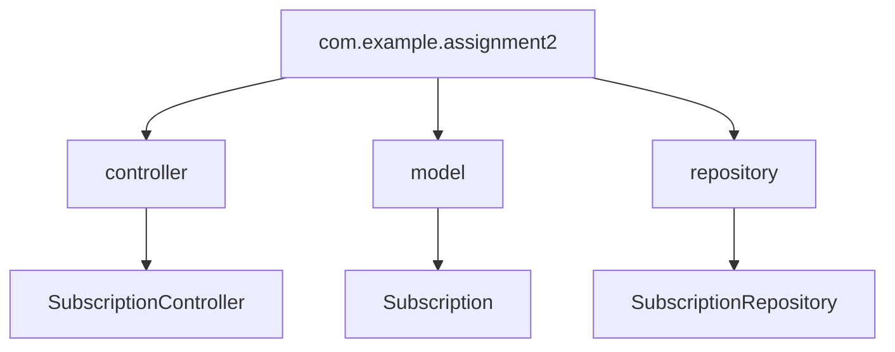
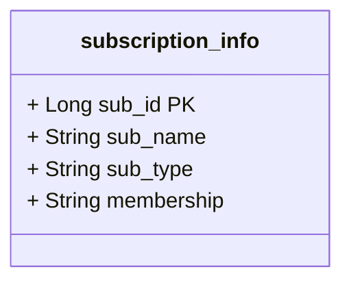

#### Assignment 3 Java API Test
# Subscription Management API :dependabot:
This is a build your own API assignment, where I have used some of my SQL tables from [Assignment 3](https://github.com/laila-sb/CFG-Assignment3) (from previous FullStack course) to demonstrate the functionality of API endpoints.
This API allows you to manage subscriptions, including creating, retrieving, and deleting subscription records. It uses a RESTful architecture, leveraging Spring Boot for handling HTTP requests and managing database interactions via JPA and the `SubscriptionRepository`.


> #### Quick Reminder
>The idea behind the database in assignment 3 was to keep track of users subscriptions. This could be a building block for a webapp to help users input their data and create a sort of tracker for all the services they might be subscribed to.


## Project Architecture:

This project follows a **Package by Layer** architecture, organizing the codebase by technical responsibilities rather than by features. Each layer has a specific role:

### Package by Layer:

- **Controller**: `SubscriptionController` handles incoming API requests and directing them to the appropriate service.
- **Repository**: `SubscriptionRepository` interfaces with the database.
- **Model**: `Subscription` represents the data model for subscriptions.



#### Below is the subscription_info table used


## Running Instructions

### Prerequisites
- Java 22
- Maven
- MySQL (DBeaver was used here, WorkBench is also fine)
- IntelliJ Idea

### Dependencies
Please see pom.xml to make sure all the required dependencies are copied over including the plugins.

### Steps to Run:
- Clone the repository:
   ```
   git clone https://github.com/yourusername/subscription-management-api.git
   cd subscription-management-api
- Run SQL code from the sql file using MySQL Workbench or DBeaver to create the database on your local system (change credentials in application.yml file)
- Build and run the Main.java file
- The API will be running at http://localhost:8080
- API can be tested using [Postman](https://www.postman.com/) or [Insomnia](https://insomnia.rest/)


## Editing Configuration
To change any configuration such as database credentials, edit the yml file


#### **Example:**
```
spring:
datasource:
url: jdbc:mysql://localhost:3306/your_db_name
username: your_username
password: your_password
server:
port: 8080  # change port if needed
```


## Testing API Endpoints with OpenAPI

The API is available in both OpenAPI spec and Swagger UI formats, once the application is running use one of the links below:

- [**OpenAPI JSON Spec**](http://localhost:8080/v3/api-docs)
- [**Swagger UI**](http://localhost:8080/swagger-ui.html)

### Example Endpoints:
- **GET** `/mysubs`: Retrieves all subscriptions.
- **GET** `/mysubs/active`: Retrieves all active subscriptions.
- **POST** `/add/sub`: Creates a new subscription.
- **DELETE** `/mysubs/delete/{identifier}`: Deletes a subscription by Identifier which can be either by id or name of subscription.


# Testing Subscription Controller MVC Test

Unit tests were written for the `subscriptionController` using Spring's Mvc framework in combination with Mockito. The aim was to validate the
functionality by simulating HTTP requests and checking the responses without running the full Spring Boot application server.
This file contains 3 tests:


**1. getAllSubscriptions_then_AllSubscriptionsReturned()** : 
- This simulates a /GET request.
- The HTTP status is 200 OK.
- The response contains two mock subscriptions.
- Both subscriptions match expected values.
- The subscriptionRepository.findAll() method is mocked to return a list of two subscriptions

**2. getAllSubscriptions_emptyListReturned()**
- This test is for the scenario where there are no subscriptions and an empty list is returned.
- This simulates a /GET request.
- The HTTP status is 200 OK.
-  Response contains empty list of subscriptions.
- The subscriptionRepository.findAll() method is mocked to return an empty list of subscriptions.

**3. getAllSubscription_invalidEndpoint()**
   This test checks how the application responds when an invalid endpoint is called:

- The HTTP status is 404 Not Found.
- No repository mocking is needed since the controller will not reach the repository due to the invalid endpoint.


### How to Run the Tests in IntelliJ IDEA
1. After Cloning the repository and open the project in IntelliJ IDEA.
2. Navigate to the Test Class
   Open the file SubscriptionControllerMockMvcTest.java located in the src/test/java/com/example/assignment2/controller/ directory.
3. Run the Tests
   To view the results, once the tests run, IntelliJ will display the results in the Run panel at the bottom. 
You'll see which tests passed or failed.


## Key Concepts learned:
- **MockMvc:** Is a Spring class used to simulate HTTP requests and test the web layer (controller) without running a full server.
- **@WebMvcTest:** Used to test Spring MVC controllers by only loading the web layer.
- **@MockBean:** Mocks a Spring bean to avoid using the real database and instead returns mocked data.
- **Mockito:** A popular Java framework used for creating mock objects and controlling the behavior of the methods in the tests.
- **Generic input:** Improving code funtionality and felxability using generics in methods (went down a rabbit hole here)
  
